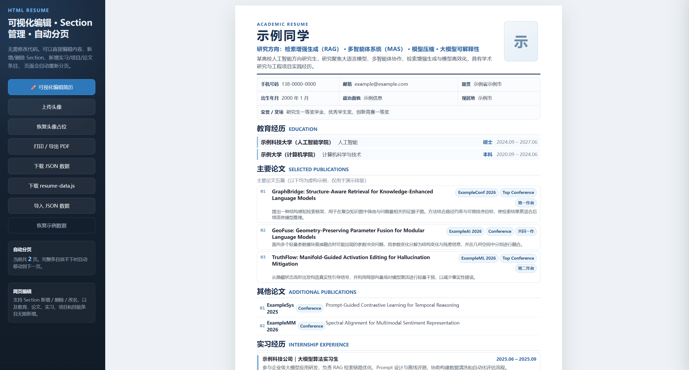
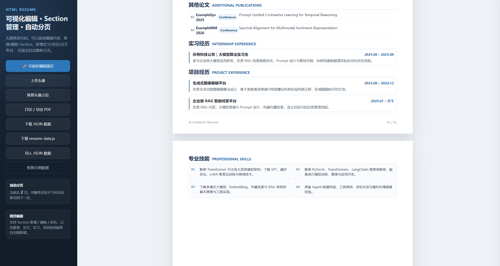
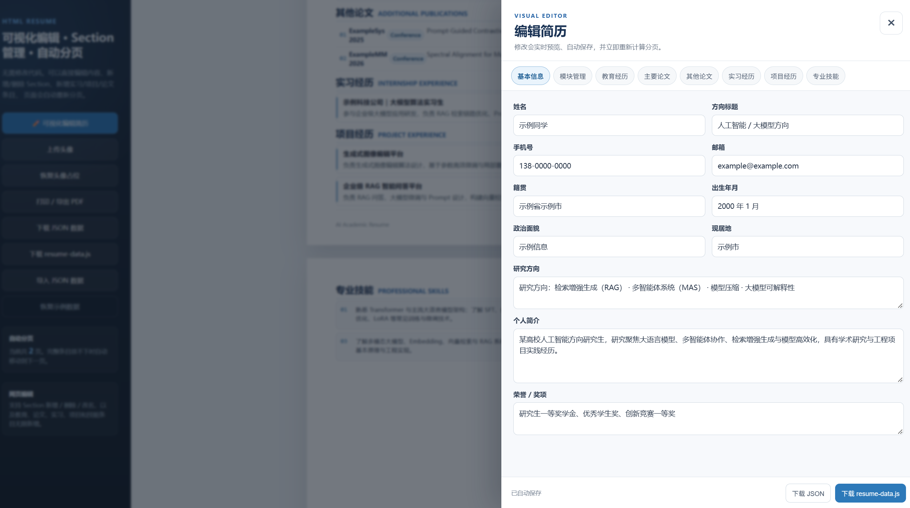

<div align="center">

# AI Academic Resume

**一个面向学术、AI、算法与研究型岗位的可视化 HTML 简历模板**

无需构建工具 · 网页直接编辑 · Section 自由管理 · 智能 A4 分页 · 一键导出 PDF

[](https://maverickquliushang.github.io/ai-academic-resume/)
[](https://github.com/Maverickquliushang/ai-academic-resume/actions)
[](#)
[](#)
[](#)

[在线体验](https://maverickquliushang.github.io/ai-academic-resume/) ·
[快速开始](#-快速开始) ·
[可视化编辑](#-可视化编辑) ·
[自动分页](#-智能-a4-分页) ·
[部署到 GitHub Pages](#-部署到-github-pages)

</div>




---

## ✨ 项目简介

**AI Academic Resume** 是一个数据驱动、纯前端的学术简历模板，适合论文、项目、实习和科研经历较多的用户。

和传统“修改 HTML / JS 源码”的简历模板不同，这个项目提供了一个内置的 **可视化简历编辑器**。打开网页即可修改个人信息、增加论文、添加实习经历、调整 Section 顺序，并实时查看最终 A4 简历效果。

整个项目只使用：

```text
HTML + CSS + Vanilla JavaScript
```

不需要安装 Node.js，不需要 `npm install`，也没有后端服务。

---

## 🚀 核心特性

| 功能 | 说明 |
| --- | --- |
| ✏️ 可视化编辑 | 直接在网页中修改简历，不需要手改 `resume-data.js` |
| 🧩 Section 管理 | Section 可新增、删除、改名、上移、下移 |
| ➕ 无限新增内容 | 教育、论文、实习、项目、技能均可继续增加 |
| 💼 实习经历 | 默认提供 `Internship Experience` Section |
| 📄 智能 A4 分页 | 根据实际内容自动生成 1 / 2 / 3 / N 页 |
| ✂️ 防文字截断 | 当前页放不下时，完整条目自动移动到下一页 |
| 🔢 动态页码 | 自动生成 `01 / N`、`02 / N`…… |
| 💾 本地自动保存 | 修改内容自动保存到浏览器 `localStorage` |
| 📥 数据导入导出 | 支持 JSON 导入 / 导出 |
| 📦 数据文件导出 | 可直接生成新的 `resume-data.js` |
| 🖼️ 自定义头像 | 支持浏览器本地上传头像 |
| 🖨️ PDF 导出 | Chrome / Edge 可直接打印成 A4 PDF |
| 🌐 GitHub Pages | 自带静态站点部署工作流 |
| 🔒 纯本地运行 | 不上传头像和简历内容，不依赖第三方 API |

---

## 🖥️ 在线 Demo

**GitHub Pages：**

https://maverickquliushang.github.io/ai-academic-resume/

打开 Demo 后，点击左侧：

```text
✏️ 可视化编辑简历
```

即可开始编辑。

> 浏览器中修改的数据默认只保存在本机。如果希望把修改后的默认内容同步回 GitHub，请使用“下载 `resume-data.js`”，然后替换仓库中的同名文件。

---

## ✏️ 可视化编辑

编辑器目前分为两个层级：

### 1. 基本信息

可以直接修改：

- 姓名
- 手机号
- 邮箱
- 籍贯
- 出生年月
- 政治面貌
- 现居地
- 研究方向
- 个人简介
- 荣誉 / 奖项

所有输入都会实时同步到右侧简历。

### 2. Section 与内容

每个 Section 都可以：

```text
修改中文标题
修改英文副标题
上移
下移
删除
编辑内部内容
```

例如可以把：

```text
项目经历
Project Experience
```

直接改成：

```text
科研项目
Research Projects
```

---

## 🧩 自定义 Section

进入：

```text
可视化编辑简历
→ 模块管理
→ 新增 Section
```

可以自由创建新的简历模块。

当前支持 5 种 Section 类型：

| Section 类型 | 适用内容 |
| --- | --- |
| 经历 / 项目 / 实习 | 实习经历、科研经历、工作经历、项目经历、校园经历 |
| 教育经历 | 本科、硕士、博士等教育信息 |
| 详细论文 | 标题、会议、级别、作者身份、论文简介 |
| 简洁论文 | 适合其他论文 / 参与论文列表 |
| 技能 | 技术栈、工具、能力描述 |

因此可以自由创建：

```text
实习经历
科研经历
开源经历
竞赛经历
校园经历
工作经历
代表性成果
课程项目
```

---

## 💼 实习经历

模板默认提供：

```text
实习经历
Internship Experience
```

每条实习包括：

```text
名称 / 单位 / 职位
时间
描述
```

例如：

```text
Example AI Company｜LLM Algorithm Intern
2026.06 – 2026.09

负责 RAG 检索优化、Prompt 设计和离线评测……
```

可以无限增加，也可以直接删除整个“实习经历” Section。

---

## 📄 智能 A4 分页

早期版本使用固定两页或者按像素切割长页面，容易出现文字被从中间裁开的情况。

当前版本采用 **Block-aware Pagination**：

```text
条目准备放入当前 A4 页面
          ↓
计算剩余空间
          ↓
     是否放得下？
       /      \
     是        否
     ↓         ↓
留在当前页   整条移到下一页
```

以下内容会作为完整分页单元：

- 教育经历
- 详细论文
- 简洁论文
- 实习 / 项目 / 工作经历
- 技能条目

因此不会出现：

```text
第一页：一行文字的上半部分
第二页：同一行文字的下半部分
```

页面数量也不是固定的。

例如：

```text
01 / 02
02 / 02
```

新增内容后可能自动变成：

```text
01 / 04
02 / 04
03 / 04
04 / 04
```

删除内容后页数也会自动减少。

> 如果“某一个单独条目”本身就长到超过完整一页 A4，模板会给出提示，此时建议精简该条目的文字。

---

## 🏁 快速开始

### 方法一：直接使用在线版

打开：

https://maverickquliushang.github.io/ai-academic-resume/

然后点击：

```text
✏️ 可视化编辑简历
```

无需安装任何东西。

### 方法二：下载到本地

Clone：

```bash
git clone https://github.com/Maverickquliushang/ai-academic-resume.git
cd ai-academic-resume
```

然后直接使用 Chrome / Edge 打开：

```text
index.html
```

即可。

---

## 📁 项目结构

```text
ai-academic-resume/
├── .github/
│   └── workflows/
│       └── deploy-pages.yml
├── assets/
│   ├── section-editor-preview.png
│   ├── smart-pagination-preview.png
│   └── ...
├── .gitignore
├── LICENSE
├── README.md
├── index.html
├── resume-data.js
├── script.js
└── styles.css
```

其中：

| 文件 | 用途 |
| --- | --- |
| `index.html` | 页面结构与可视化编辑器入口 |
| `resume-data.js` | 默认简历数据 |
| `script.js` | 编辑器、自动保存、Section 管理、智能分页 |
| `styles.css` | A4 页面、编辑器、打印与响应式样式 |
| `deploy-pages.yml` | GitHub Pages 自动部署 |
| `assets/` | README 预览图 |

---

## 💾 数据保存

### 浏览器自动保存

网页编辑后的数据会存储在：

```text
localStorage
```

因此刷新页面后仍然可以继续编辑。

这些数据：

- 不会上传服务器
- 不会提交到 GitHub
- 不会被其他用户看到
- 只存在当前浏览器

### 导出 JSON

可以点击：

```text
下载 JSON 数据
```

保存一份可再次导入的简历数据。

### 导出 `resume-data.js`

如果希望修改 GitHub Pages 的默认简历：

```text
编辑完成
    ↓
下载 resume-data.js
    ↓
上传到 GitHub
    ↓
替换旧 resume-data.js
    ↓
Commit changes
    ↓
GitHub Pages 自动重新部署
```

---

## 🖼️ 更换头像

点击：

```text
上传头像
```

图片会保存在浏览器本地。

不想使用头像时点击：

```text
恢复头像占位
```

即可。

---

## 🖨️ 导出 PDF

推荐使用 Chrome 或 Edge。

点击：

```text
打印 / 导出 PDF
```

打印设置建议：

```text
目标：保存为 PDF
纸张：A4
边距：无
背景图形：开启
缩放：默认 / 100%
```

最终页数会与网页中自动生成的 A4 页面数量一致。

---

## 🌐 部署到 GitHub Pages

仓库已经包含：

```text
.github/workflows/deploy-pages.yml
```

上传代码后，进入 GitHub：

```text
Settings
→ Pages
→ Build and deployment
→ Source
→ GitHub Actions
```

然后进入：

```text
Actions
```

等待：

```text
Deploy static resume demo to GitHub Pages
```

运行成功。

默认 Demo 地址：

```text
https://maverickquliushang.github.io/ai-academic-resume/
```

---

## 🎨 自定义样式

页面配色集中定义在 `styles.css`：

```css
:root {
  --navy: #183153;
  --blue: #2563a6;
  --blue-soft: #edf5fc;
  --ink: #182230;
  --text: #344254;
}
```

修改这些变量即可快速更换整体主题。

A4 页面尺寸为：

```css
--page-width: 210mm;
--page-height: 297mm;
```

---

## 🔒 隐私说明

项目是纯静态网页：

- 不包含后端
- 不上传用户简历
- 不上传头像
- 不包含统计代码
- 不依赖远程 API
- 编辑内容默认仅存储在浏览器本地

仓库内自带的示例：

- 姓名
- 联系方式
- 学校
- 论文
- 项目
- 实习
- 奖项

均为虚构数据。

---

## 🤝 Contributing

欢迎 Issue 和 Pull Request。

如果你希望增加新的 Section 类型、主题样式或编辑功能，可以：

```bash
git checkout -b feature/my-feature
```

修改后提交 Pull Request。

比较适合贡献的方向包括：

- 更多简历主题
- Section 拖拽排序
- 中英文双语简历
- ATS 风格模板
- LaTeX / Markdown 导出
- 更完善的移动端编辑体验
- 多套简历数据切换

---

<div align="center">

如果这个项目对你有帮助，欢迎 ⭐ Star。

**[Live Demo](https://maverickquliushang.github.io/ai-academic-resume/) · [Back to Top](#ai-academic-resume)**

</div>
