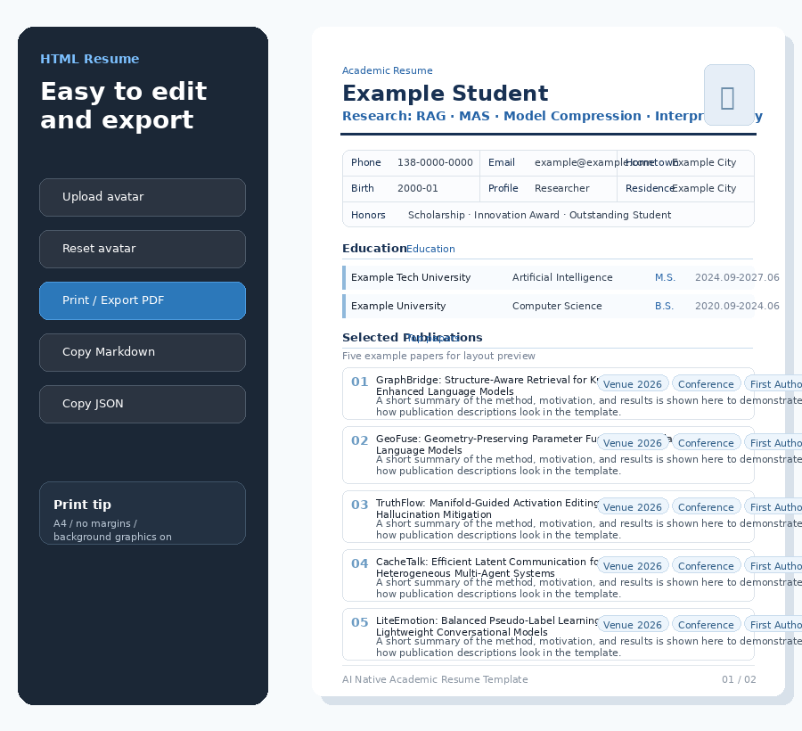
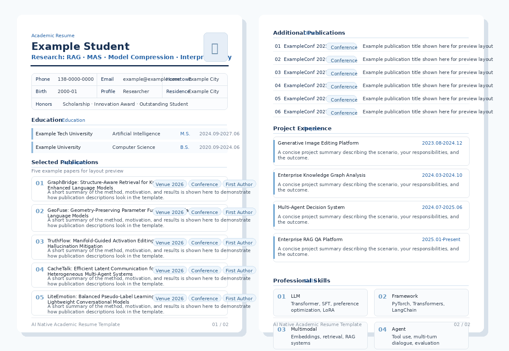

<div align="center">

# AI Academic Resume

**A clean, data-driven A4 HTML resume template for academic, AI, algorithm, and research roles.**

[](https://maverickquliushang.github.io/ai-academic-resume/)
[](./LICENSE)
[](#)
[](#)
[](#)
[](#)

[在线预览](https://maverickquliushang.github.io/ai-academic-resume/) · [快速开始](#-快速开始) · [修改简历](#-修改简历内容) · [导出-pdf](#-导出-pdf)

</div>


## ✨ 项目简介

**AI Academic Resume** 是一个面向 **学术 / AI / 算法 / 研究型岗位** 的数据驱动 HTML 简历模板。

它将简历内容与页面样式分离：日常维护只需要修改 `resume-data.js`，无需反复调整 HTML。项目完全由原生 HTML、CSS 和 JavaScript 构成，无需 Node.js、npm 或任何构建工具，可以直接在浏览器中运行，并通过浏览器原生打印功能导出 A4 PDF。

> 仓库中的姓名、联系方式、学校、论文、会议、项目与奖项均为虚构示例，仅用于展示模板结构和排版效果。

## 📌 目录

- [项目简介](#-项目简介)
- [主要特性](#-主要特性)
- [效果预览](#-效果预览)
- [目录结构](#-目录结构)
- [快速开始](#-快速开始)
- [修改简历内容](#-修改简历内容)
- [导出 PDF](#-导出-pdf)
- [GitHub Pages 在线 Demo](#-github-pages-在线-demo)
- [头像功能](#-头像功能)
- [主题与样式](#-主题与样式)
- [分页说明](#-分页说明)
- [隐私说明](#-隐私说明)
- [License](#-license)

## 🚀 主要特性

- **数据驱动**：简历信息集中维护在 `resume-data.js`
- **A4 原生排版**：针对浏览器打印与 PDF 导出优化
- **双页学术结构**：适合论文、项目较多的研究型简历
- **零构建依赖**：无需 npm、Node.js 或框架
- **本地头像**：头像仅保存在浏览器本地，不上传服务器
- **一键导出 PDF**：直接调用浏览器打印功能
- **复制 Markdown / JSON**：便于迁移到其他简历系统或 AI 工具
- **响应式预览**：兼容桌面端与移动端浏览
- **GitHub Pages**：仓库内置自动部署工作流
- **隐私友好**：模板本身不包含统计代码、网络请求或真实个人数据

## 🖼️ 效果预览

### 编辑与导出面板

左侧控制面板提供头像上传、PDF 导出以及 Markdown / JSON 复制功能。



### A4 学术简历布局

默认采用两页 A4：第一页突出教育背景与主要论文，第二页展示其他论文、项目经历与专业技能。



## 📁 目录结构

```text
ai-academic-resume/
├── .github/
│   └── workflows/
│       └── deploy-pages.yml
├── assets/
│   ├── preview.png
│   ├── feature-controls.png
│   └── feature-pages.png
├── .gitignore
├── LICENSE
├── README.md
├── index.html
├── resume-data.js
├── script.js
└── styles.css
```

核心文件职责：

| 文件 | 用途 |
| --- | --- |
| `resume-data.js` | 简历内容，日常更新主要修改这里 |
| `index.html` | 页面结构与两页 A4 骨架 |
| `styles.css` | 页面视觉、打印样式与响应式布局 |
| `script.js` | 数据渲染、头像、复制与打印功能 |
| `.github/workflows/deploy-pages.yml` | GitHub Pages 自动部署 |

## ⚡ 快速开始

### 方法一：直接下载

下载仓库后，直接用 Chrome / Edge 打开：

```text
index.html
```

无需安装任何依赖。

### 方法二：Git 克隆

```bash
git clone https://github.com/Maverickquliushang/ai-academic-resume.git
cd ai-academic-resume
```

然后直接打开 `index.html`。

## ✏️ 修改简历内容

绝大多数情况下，你只需要编辑：

```text
resume-data.js
```

### 基本信息

```javascript
basics: {
  name: "你的名字",
  title: "人工智能 / 大模型方向",
  phone: "138-0000-0000",
  email: "your@email.com",
  currentResidence: "上海"
}
```

### 新增论文

```javascript
publications: [
  {
    title: "Your Paper Title",
    venue: "Conference 2027",
    level: "CCF A",
    role: "First Author",
    description: "简要概括论文的问题、方法与结果。"
  }
]
```

### 新增项目

```javascript
projects: [
  {
    title: "项目名称",
    period: "2026.01 – 至今",
    summary: "说明项目背景、你的职责、技术方案与结果。"
  }
]
```

### 修改技能

```javascript
skills: [
  "熟悉 Transformer、SFT、LoRA 与大模型训练流程。",
  "熟悉 PyTorch、Transformers、LangChain 等框架。"
]
```

修改完成后刷新 `index.html` 即可看到结果。

## 🖨️ 导出 PDF

推荐使用 Chrome 或 Edge：

1. 打开 `index.html`
2. 点击左侧 **打印 / 导出 PDF**
3. 目标打印机选择 **保存为 PDF**
4. 纸张选择 **A4**
5. 边距选择 **无**
6. 开启 **背景图形**

模板已经配置：

```css
@page {
  size: A4;
  margin: 0;
}
```

页脚采用正常文档流布局，避免打印时覆盖正文。

## 🌐 GitHub Pages 在线 Demo

本仓库已经内置 GitHub Pages 自动部署工作流：

```text
.github/workflows/deploy-pages.yml
```

发布步骤：

1. 将仓库上传到 GitHub，仓库名建议使用 `ai-academic-resume`
2. 确保默认分支为 `main`
3. 打开 **Settings → Pages**
4. 将 **Source** 设置为 **GitHub Actions**
5. push 代码后等待 Actions 完成

部署成功后，在线地址为：

```text
https://maverickquliushang.github.io/ai-academic-resume/
```

## 🖼️ 头像功能

点击左侧 **上传头像** 可以选择本地图片。

头像通过浏览器 `localStorage` 保存：

- 不会上传到服务器
- 不会进入 GitHub 仓库
- 不会修改 `resume-data.js`

点击 **恢复头像占位** 即可清除本地头像。

## 🎨 主题与样式

主要主题色位于 `styles.css` 顶部：

```css
:root {
  --navy: #183153;
  --blue: #2563a6;
  --blue-soft: #edf5fc;
}
```

你可以直接修改这些变量快速更换主题。

如果想调整字体大小、论文卡片间距或页面留白，也建议统一在 `styles.css` 中修改，不要将样式写入 `resume-data.js`。

## 📄 分页说明

默认采用两页 A4：

```text
Page 1
├── 基本信息
├── 教育经历
└── 主要论文

Page 2
├── 其他论文
├── 项目经历
└── 专业技能
```

这种布局更适合论文与项目较多的研究型简历。

如果你的内容较少，可以删除第二页；如果内容更多，可以继续添加：

```html
<article class="resume-page">
  ...
</article>
```

## 🔐 隐私说明

模板本身：

- 不包含真实个人信息
- 不包含统计脚本
- 不包含第三方 API
- 不主动发送网络请求
- 不上传头像
- 不上传简历内容

所有简历渲染和头像处理均在浏览器本地完成。

## 🤝 Contributing

欢迎提交 Issue 或 Pull Request，例如：

- 新主题配色
- 单页 / 三页布局
- 英文版字段
- 更灵活的打印分页
- 更多 Academic CV 模块

## 📄 License

本项目使用 [MIT License](./LICENSE)。

---

<div align="center">

如果这个模板对你有帮助，欢迎 ⭐ Star。

**Made for researchers, AI engineers, and students who prefer a clean resume workflow.**

</div>
